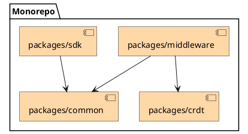

```plantuml
@startuml

!define RECTANGLE class
!define MAX_X 1

skinparam roundCorner 0
skinparam component {
  FontColor Black
}
package "Monorepo" {
  [packages/middleware] #ffd8a8
  [packages/common] #ffd8a8
  [packages/crdt] #ffd8a8
  [packages/sdk] #ffd8a8

[packages/middleware] --> [packages/crdt]
[packages/middleware] --> [packages/common]
[packages/sdk] --> [packages/common]
}
@enduml
```