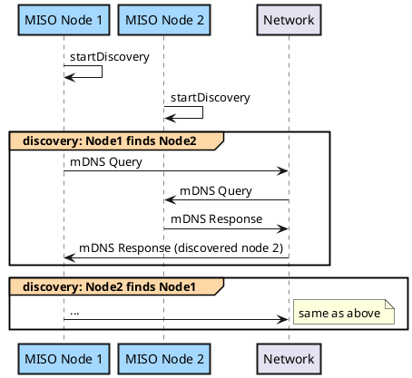

## Node Discovery

```plantuml
@startuml
skinparam roundCorner 0
skinparam SequenceParticipantBorderThickness 2
skinparam sequenceGroupBackgroundColor #ffd8a8
participant "MISO Node 1" #a5d8ff
participant "MISO Node 2" #a5d8ff


"MISO Node 1" -> "MISO Node 1": startDiscovery
"MISO Node 2" -> "MISO Node 2": startDiscovery

group discovery: Node1 finds Node2
"MISO Node 1" -> Network: mDNS Query
Network -> "MISO Node 2": mDNS Query
"MISO Node 2" -> Network: mDNS Response
Network -> "MISO Node 1": mDNS Response (discovered node 2)
end 
group discovery: Node2 finds Node1
"MISO Node 1" -> Network: ...
note right: same as above
end
@enduml
```