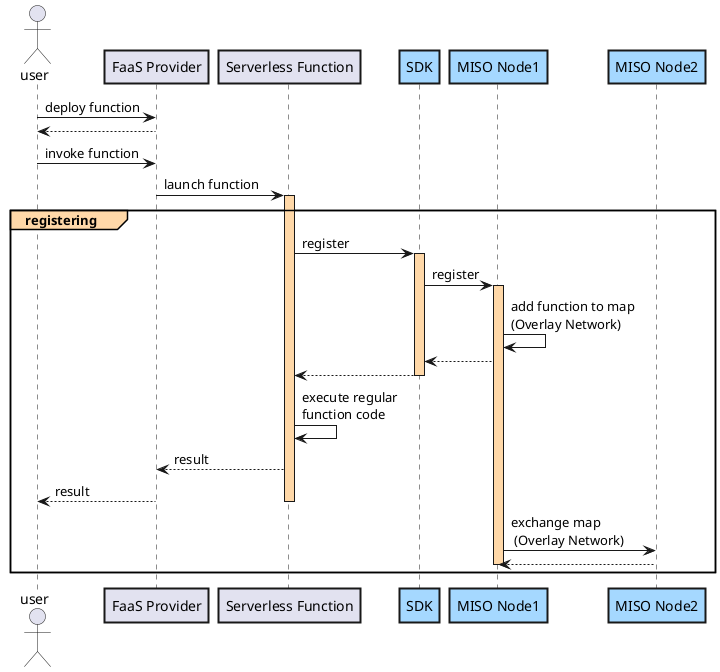
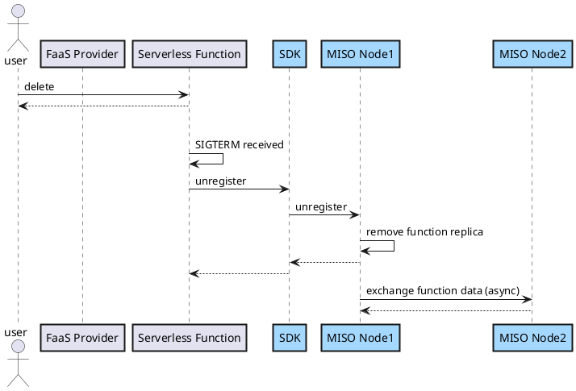

## Function registering

```plantuml
@startuml
skinparam roundCorner 0
skinparam SequenceParticipantBorderThickness 2
skinparam sequenceGroupBackgroundColor #ffd8a8
actor user
participant "FaaS Provider"
participant "Serverless Function"
participant SDK #a5d8ff
participant "MISO Node1" #a5d8ff
participant "MISO Node2" #a5d8ff

user -> "FaaS Provider": deploy function
"FaaS Provider" --> user
user -> "FaaS Provider": invoke function
"FaaS Provider" -> "Serverless Function": launch function

group registering
activate "Serverless Function" #ffd8a8
"Serverless Function" -> SDK: register
activate SDK #ffd8a8
SDK -> "MISO Node1" : register
activate "MISO Node1" #ffd8a8
"MISO Node1" -> "MISO Node1": add function to map\n(Overlay Network)
"MISO Node1" --> SDK
SDK --> "Serverless Function"
deactivate SDK
"Serverless Function" -> "Serverless Function": execute regular\nfunction code
"Serverless Function" --> "FaaS Provider": result
"FaaS Provider" --> user: result
deactivate "Serverless Function"
"MISO Node1" -> "MISO Node2": exchange map\n (Overlay Network)
"MISO Node2" --> "MISO Node1"
deactivate "MISO Node1"


end
@enduml
```

# Unregistering

```plantuml
@startuml
skinparam roundCorner 0
skinparam SequenceParticipantBorderThickness 2
skinparam sequenceGroupBackgroundColor #ffd8a8
actor user
participant "FaaS Provider"
participant "Serverless Function"
participant SDK #a5d8ff
participant "MISO Node1" #a5d8ff
participant "MISO Node2" #a5d8ff


user -> "Serverless Function": delete
"Serverless Function" --> user
group unregistering
"Serverless Function" -> "Serverless Function": SIGTERM received

"Serverless Function" -> SDK: unregister
SDK -> "MISO Node1": unregister
"MISO Node1" -> "MISO Node1": remove function replica
"MISO Node1" --> SDK
SDK --> "Serverless Function"
"MISO Node1" -> "MISO Node2": exchange function data (async)
"MISO Node2" --> "MISO Node1"
@enduml
```