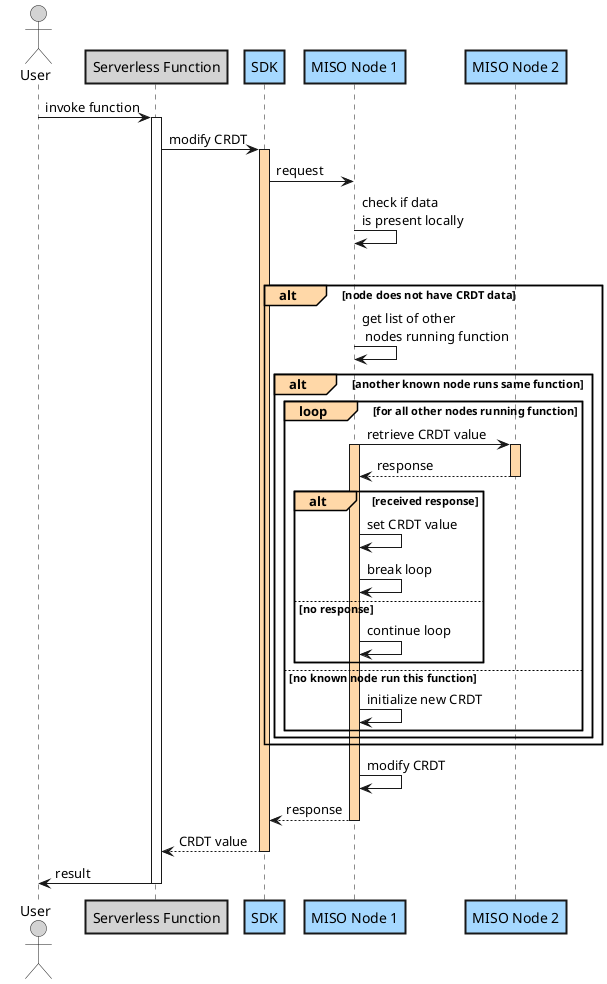

## Function registering

```plantuml
@startuml
skinparam roundCorner 0
skinparam SequenceParticipantBorderThickness 2
skinparam sequenceGroupBackgroundColor #ffd8a8
actor User #LightGrey
participant "Serverless Function" #LightGrey 
participant SDK #a5d8ff
participant "MISO Node 1" #a5d8ff
participant "MISO Node 2" #a5d8ff

User -> "Serverless Function": invoke function
activate "Serverless Function"
"Serverless Function" -> SDK: modify CRDT
activate "SDK" #ffd8a8
SDK -> "MISO Node 1": request
"MISO Node 1" -> "MISO Node 1": check if data \nis present locally
group modify crdt
alt node does not have CRDT data 
"MISO Node 1" -> "MISO Node 1": get list of other\n nodes running function
alt another known node runs same function
loop for all other nodes running function

"MISO Node 1" -> "MISO Node 2" : retrieve CRDT value

activate "MISO Node 1" #ffd8a8
activate "MISO Node 2" #ffd8a8
"MISO Node 2" --> "MISO Node 1": response
deactivate "MISO Node 2"
alt received response
"MISO Node 1" -> "MISO Node 1": set CRDT value
"MISO Node 1" -> "MISO Node 1": break loop
else no response
"MISO Node 1" -> "MISO Node 1": continue loop
end
else no known node run this function
"MISO Node 1" -> "MISO Node 1": initialize new CRDT

end
end
end
"MISO Node 1" -> "MISO Node 1": modify CRDT
"MISO Node 1" --> SDK: response
deactivate "MISO Node 1"
SDK --> "Serverless Function": CRDT value
deactivate "SDK"

"Serverless Function" -> User: result
deactivate "Serverless Function"
@enduml
```